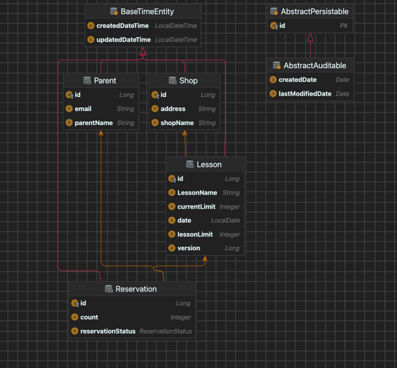

# 2024 째깍악어 과제

## 실행 및 테스트

<hr>

1. 서버실행(port : 8080)
2. 스웨거 명세서가 제공됩니다. 서버 실행후 아래 링크로 접속하시면 됩니다.
3. 서버실행시 & 테스트 코드 실행시 schema.sql 의 더미데이터가 들어가 있습니다.
- swagger url : [Swagger UI](http://localhost:8080/swagger-ui/index.html)
- H2-console : [H2 Console](http://localhost:8080/h2-console)
  - userName: root
  - pw : root

<hr>

## 구현 설명

본 과제는 예약하고, 조회하고, 예약취소 하는 기능이 있습니다. <br> 
이때 예약에 대해 동시성 처리는 낙관적락을 사용하여 처리 했습니다. <br>
과제라서 재시도 처리 등 단순화 하였습니다.

### 설계

연관관계는 다음과 같습니다. <br>
매장 1:N 수업 | 수업 1:N 예약 | 예약 1:1 부모 <br>
예약 -> 부모 <br>
예약 -> 수업 -> 매장 <br>
위와 같이 단방향으로 설정했습니다. <br>

### 구조

```text
.
├── main
│   ├── java
│   │   └── com
│   │       └── crocodile
│   │           └── api
│   │               ├── CrocodileApiApplication.java
│   │               ├── common
│   │               │   ├── config
│   │               │   │   ├── QuerydslConfig.java
│   │               │   │   └── SwaggerConfig.java
│   │               │   ├── domain
│   │               │   │   └── BaseTimeEntity.java
│   │               │   ├── exception
│   │               │   │   ├── CrocodileIllegalArgumentException.java
│   │               │   │   ├── CustomErrorCode.java
│   │               │   │   └── GlobalExceptionHandler.java
│   │               │   ├── rest
│   │               │   │   └── RestResponse.java
│   │               │   └── utils
│   │               │       └── LocalDateUtils.java
│   │               ├── lesson
│   │               │   ├── domain
│   │               │   │   └── Lesson.java
│   │               │   ├── dto
│   │               │   │   └── LessonDto.java
│   │               │   ├── operator
│   │               │   │   └── LessonLimitDecreaseOperator.java
│   │               │   ├── provider
│   │               │   │   └── LessonVarProvider.java
│   │               │   └── repository
│   │               │       └── LessonRepository.java
│   │               ├── parent
│   │               │   ├── domain
│   │               │   │   └── Parent.java
│   │               │   └── repository
│   │               │       └── ParentRepository.java
│   │               ├── reservation
│   │               │   ├── controller
│   │               │   │   ├── command
│   │               │   │   │   ├── ReservationCancelPut.java
│   │               │   │   │   ├── ReservationPost.java
│   │               │   │   │   ├── model
│   │               │   │   │   │   └── ReservationPostRequest.java
│   │               │   │   │   └── validator
│   │               │   │   │       └── ReservationValidator.java
│   │               │   │   └── query
│   │               │   │       ├── ReservationCustomersGet.java
│   │               │   │       └── ReservationHistoriesGet.java
│   │               │   ├── domain
│   │               │   │   ├── Reservation.java
│   │               │   │   └── enumeration
│   │               │   │       └── ReservationStatus.java
│   │               │   ├── dto
│   │               │   │   ├── ReservationCustomerDto.java
│   │               │   │   └── ReservationDto.java
│   │               │   ├── operator
│   │               │   │   ├── ReservationCancelOperator.java
│   │               │   │   └── ReservationOperator.java
│   │               │   ├── provider
│   │               │   │   ├── ReservationByIdProvider.java
│   │               │   │   ├── ReservationDuplicateProvider.java
│   │               │   │   └── ReservationProvider.java
│   │               │   ├── repository
│   │               │   │   ├── ReservationRepository.java
│   │               │   │   └── impl
│   │               │   └── service
│   │               │       ├── ReservationCustomerService.java
│   │               │       ├── ReservationHistoryService.java
│   │               │       └── model
│   │               └── shop
│   │                   ├── domain
│   │                   │   └── Shop.java
│   │                   └── repository
│   │                       ├── ShopRepository.java
│   │                       └── impl
│   └── resources
│       ├── application.properties
│       ├── application.yml
│       └── schema.sql
└── test
    └── java
        └── com
            └── crocodile
                └── api
                    └── LessonTests.java

```

CQRS 를 고려하여 패키지를 나눴습니다. 추후에 db replication 도 고려 할 수 있습니다.

- r(read)
  - controller : query
  - service : service -> `@Trascational(readOnly=true)`
  - repository : provider -> `@Trascational(readOnly=true)`
- cud(create,update,delete)
  - controller : command
  - service : operator
  - repository : repository

- 패키지 설명
  - controller : 컨트롤러 계층입니다.
    - query : Read 전용 컨트롤러 패키지 명입니다.
    - command : CUD 와 같이 업데이트가 일어나는 패키지 명입니다.
  - service : Read 전용 서비스 계층 패키지명 입니다. query router 는 service 만 주입 받습니다.
  - operator : CUD 서비스 계층 패키지명 입니다. command router 는 operator 만 주입 받습니다.
  - provider : querydsl 을 사용하고 n+1 방지하여 fetchJoin 이나 projection 으로 바로 dto 로 조회하기 위한 용도 입니다. service 는 provider 만 주입 받습니다.
  - repository : spring data jpa 로 조회하는 영속성 계층 패키지명 입니다. read-only = false
- common 은 config, custom-exception, custom-response 등을 모아놓은 공통 패키지 입니다.

### 예외처리
커스텀 예외를 만들어서 처리 했습니다.

<hr>

## ERD


## DB DDL & DML

```sql
-- DDL

DROP TABLE IF EXISTS shop CASCADE;
DROP TABLE IF EXISTS parent CASCADE;
DROP TABLE IF EXISTS lesson CASCADE;
DROP TABLE IF EXISTS reservation CASCADE;

CREATE TABLE shop
(
  id                bigint generated by default as identity,
  shop_name         varchar(100) not null,
  address           varchar(255) not null,
  created_date_time DATETIME     not null,
  updated_date_time DATETIME     not null,
  primary key (id)
);

CREATE TABLE parent
(
  id                bigint generated by default as identity,
  parent_name       varchar(50)  not null,
  email             varchar(255) not null,
  created_date_time DATETIME     not null,
  updated_date_time DATETIME     not null,
  primary key (id)
);

CREATE TABLE lesson
(
  id                bigint generated by default as identity,
  shop_id           bigint             not null,
  lesson_name       varchar(100)       not null,
  lesson_limit      integer default 20 not null,
  current_limit     integer default 20  not null,
  version           bigint  default 0  not null,
  date              DATE               not null,
  created_date_time DATETIME           not null,
  updated_date_time DATETIME           not null,
  primary key (id)
);

CREATE TABLE reservation
(
  id                 bigint generated by default as identity,
  lesson_id          bigint      not null,
  parent_id          bigint      not null,
  count              integer     not null,
  reservation_status varchar(50) not null,
  created_date_time  DATETIME    not null,
  updated_date_time  DATETIME    not null,
  primary key (id)
);

-- lesson 테이블에 shop_id 외래 키 추가
ALTER TABLE lesson
  ADD CONSTRAINT fk_shop_id
    FOREIGN KEY (shop_id)
      REFERENCES shop (id);

-- reservation 테이블에 lesson_id 외래 키 추가
ALTER TABLE reservation
  ADD CONSTRAINT fk_lesson_id
    FOREIGN KEY (lesson_id)
      REFERENCES lesson (id);

-- reservation 테이블에 parent_id 외래 키 추가
ALTER TABLE reservation
  ADD CONSTRAINT fk_parent_id
    FOREIGN KEY (parent_id)
      REFERENCES parent (id);


-- DML

INSERT INTO shop (shop_name, address, created_date_time, updated_date_time)
VALUES ('잠실', '서울시 송파구', NOW(), NOW()),
       ('일산', '경기도 일산시', NOW(), NOW()),
       ('판교', '경기도 성남시', NOW(), NOW());

INSERT INTO parent (parent_name, email, created_date_time, updated_date_time)
VALUES ('권나라', 'parent1@gmail.com', NOW(), NOW()),
       ('아이유', 'parent2@gmail.com', NOW(), NOW()),
       ('최민식', 'parent3@gmail.com', NOW(), NOW()),
       ('코카코', 'parent4@gmail.com', NOW(), NOW()),
       ('이이이', 'parent5@gmail.com', NOW(), NOW());

INSERT INTO lesson (shop_id, lesson_name, date, created_date_time, updated_date_time)
VALUES (1, '도시농부', '2024-03-05', NOW(), NOW()),
       (2, '도시농부', '2024-03-05', NOW(), NOW()),
       (3, '도시농부', '2024-03-05', NOW(), NOW()),
       (1, '도시농부', '2024-03-06', NOW(), NOW()),
       (2, '도시농부', '2024-03-06', NOW(), NOW()),
       (3, '도시농부', '2024-03-06', NOW(), NOW()),
       (1, '도시농부', '2024-03-07', NOW(), NOW()),
       (2, '도시농부', '2024-03-07', NOW(), NOW()),
       (3, '도시농부', '2024-03-07', NOW(), NOW()),
       (1, '도시농부', '2024-03-08', NOW(), NOW()),
       (2, '도시농부', '2024-03-08', NOW(), NOW()),
       (3, '도시농부', '2024-03-08', NOW(), NOW()),
       (1, '도시농부', '2024-03-09', NOW(), NOW()),
       (2, '도시농부', '2024-03-09', NOW(), NOW()),
       (3, '도시농부', '2024-03-09', NOW(), NOW());

INSERT INTO lesson (shop_id, lesson_name, date, created_date_time, updated_date_time)
VALUES (1, '드로잉', '2024-03-10', NOW(), NOW()),
       (2, '드로잉', '2024-03-10', NOW(), NOW()),
       (3, '드로잉', '2024-03-10', NOW(), NOW()),
       (1, '드로잉', '2024-03-11', NOW(), NOW()),
       (2, '드로잉', '2024-03-11', NOW(), NOW()),
       (3, '드로잉', '2024-03-11', NOW(), NOW()),
       (1, '드로잉', '2024-03-12', NOW(), NOW()),
       (2, '드로잉', '2024-03-12', NOW(), NOW()),
       (3, '드로잉', '2024-03-12', NOW(), NOW()),
       (1, '드로잉', '2024-03-13', NOW(), NOW()),
       (2, '드로잉', '2024-03-13', NOW(), NOW()),
       (3, '드로잉', '2024-03-13', NOW(), NOW()),
       (1, '드로잉', '2024-03-14', NOW(), NOW()),
       (2, '드로잉', '2024-03-14', NOW(), NOW()),
       (3, '드로잉', '2024-03-14', NOW(), NOW()),
       (1, '드로잉', '2024-03-15', NOW(), NOW()),
       (2, '드로잉', '2024-03-15', NOW(), NOW()),
       (3, '드로잉', '2024-03-15', NOW(), NOW());

INSERT INTO lesson (shop_id, lesson_name, date, created_date_time, updated_date_time)
VALUES (1, '오감놀이', '2024-03-16', NOW(), NOW()),
       (2, '오감놀이', '2024-03-16', NOW(), NOW()),
       (3, '오감놀이', '2024-03-16', NOW(), NOW()),
       (1, '오감놀이', '2024-03-17', NOW(), NOW()),
       (2, '오감놀이', '2024-03-17', NOW(), NOW()),
       (3, '오감놀이', '2024-03-17', NOW(), NOW()),
       (1, '오감놀이', '2024-03-18', NOW(), NOW()),
       (2, '오감놀이', '2024-03-18', NOW(), NOW()),
       (3, '오감놀이', '2024-03-18', NOW(), NOW()),
       (1, '오감놀이', '2024-03-19', NOW(), NOW()),
       (2, '오감놀이', '2024-03-19', NOW(), NOW()),
       (3, '오감놀이', '2024-03-19', NOW(), NOW());

```
